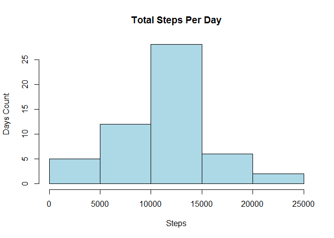

# Reproducible Research: Peer Assessment 1

## Overview

In this assignment, we are required to create a R makrdown and associated results files as part of the reproducable research course project. For this assignment, the data from a personal activity monitoring device is used. The monitoring device collected the activity data at every 5 minutes through out the day. The data set provided consists of two months of data from an anonymous individual collected during the months of October and November, 2012 and include the number of steps taken in 5 minute intervals each day. 
The data for this assignment can be downloaded from the course web site: [Activity monitoring data](https://d396qusza40orc.cloudfront.net/repdata%2Fdata%2Factivity.zip)

The goal of this assignment is to review, process and analyze the data to find patterns in the person's activity while documenting the steps so that the research can reproduced in the future as needed.


## Loading and preprocessing the data

The zip file was downloaded and extracted to the current working directory. 


```r
## if the file does not exist, download and extract to the working directory
if(!file.exists("activity.zip")) {
  url <- "https://d396qusza40orc.cloudfront.net/repdata%2Fdata%2Factivity.zip"
  download.file(url, destfile = "activity.zip")
  unzip("activity.zip")
}
## read the csv file into a dataframe
fiveMinuteActivityData <- read.csv("activity.csv", sep=',')

## printing sample rows, number of rows, column names and the count of records with NAs.
head(fiveMinuteActivityData)
```

```
##   steps       date interval
## 1    NA 2012-10-01        0
## 2    NA 2012-10-01        5
## 3    NA 2012-10-01       10
## 4    NA 2012-10-01       15
## 5    NA 2012-10-01       20
## 6    NA 2012-10-01       25
```

```r
nrow(fiveMinuteActivityData)
```

```
## [1] 17568
```

```r
names(fiveMinuteActivityData)
```

```
## [1] "steps"    "date"     "interval"
```

```r
sum(is.na(fiveMinuteActivityData))
```

```
## [1] 2304
```

The downloaded zip file had one comma-separated-value file with the following variables:

* steps: Number of steps taking in a 5-minute interval (missing values are coded as NA)
* date: The date on which the measurement was taken in YYYY-MM-DD format
* interval: Identifier for the 5-minute interval in which measurement was taken

The dataset had a total of 17,568 observations out of which 2304 observations had no data available for the steps.


## What is mean total number of steps taken per day?

The mean total number of steps taken per day is calculated first by summing the number of steps per day then taking the mean for all the days observed. The histogram shows a nice distribution of total number of steps per day over intervals. 


```r
# sum the steps by date and ignore the NAs

dailyDataSet <- aggregate(. ~ date, data = fiveMinuteActivityData, na.rm=TRUE,FUN = sum)

# plot a histogram of total steps per day
hist(dailyDataSet$steps, col="lightblue", main="Total Steps Per Day", xlab="Interval")
```

<!-- -->

The mean total number of steps per day is:


```r
mean(dailyDataSet$steps)
```

```
## [1] 10766.19
```

The median of total number of steps taken per day is:


```r
median(dailyDataSet$steps)
```

```
## [1] 10765
```

## What is the average daily activity pattern?

The average daily activity pattern is best described with a line chart of average number of steps per interval against the intervals in the day.


```r
intervalAvgDataSet <- aggregate(steps ~ interval, data = fiveMinuteActivityData, na.rm=TRUE,FUN = mean)

plot(steps ~ interval, data=intervalAvgDataSet, type="l", xlab="Intervals", ylab="Average Number of Steps")
```

<!-- -->

```r
maxInerval <- intervalAvgDataSet[which.max(intervalAvgDataSet$steps),1]
```

From the chart it is clear that the 5-minute interval with maximum average number of steps is:

```r
maxInerval
```

```
## [1] 835
```

And the maximum average number of steps is:

```r
intervalAvgDataSet[which.max(intervalAvgDataSet$steps),2]
```

```
## [1] 206.1698
```

## Imputing missing values

As it is already mentioned in the data input summary section, there are 2304 observations with missing data.


```r
sum(is.na(fiveMinuteActivityData))
```

```
## [1] 2304
```

All the NA are in the steps column. The missing number of steps are filled by the average number of steps for the 5-minute interval. Please not that after the fill, the 2012-10-01 interval steps are not NA anymore. To evaluate the impact of the imputing the missing values, a data set equivalent to the original with missing value filled is created. 


```r
## create dataframe same as the original but the NA values filled with the 5-minute interval average steps.
fiveMinuteDataMissingFilled <- transform(fiveMinuteActivityData, steps=ifelse(is.na(fiveMinuteActivityData$steps),                               intervalAvgDataSet$steps[match(fiveMinuteActivityData$interval,intervalAvgDataSet$interval)], fiveMinuteActivityData$steps))

head(fiveMinuteDataMissingFilled)
```

```
##       steps       date interval
## 1 1.7169811 2012-10-01        0
## 2 0.3396226 2012-10-01        5
## 3 0.1320755 2012-10-01       10
## 4 0.1509434 2012-10-01       15
## 5 0.0754717 2012-10-01       20
## 6 2.0943396 2012-10-01       25
```

```r
## 
dailyDataSetNAFilled <- aggregate(.~ date, data = fiveMinuteDataMissingFilled,FUN = sum)

# plot a histogram of total steps per day
hist(dailyDataSetNAFilled$steps, main="Total Steps Per Day",col="lightblue",xlab="Interval")
```

<!-- -->

```r
mean(dailyDataSetNAFilled$steps)
```

```
## [1] 10766.19
```

```r
median(dailyDataSetNAFilled$steps)
```

```
## [1] 10766.19
```

The histogram this time shows higher number of daily total steps. Also the mean and median values are the same this time. There is no much difference between the mean and median values with and without NAs. This could be because, for the given data set, there were several days with steps not available. Hence, filling them with the mean for 5-minute interval resulted the mean and median to be the same and very close to that of with dataset ingoring the NAs. The conclusion is that there is no significant change in the distribution of the number of steps across intervals.

## Are there differences in activity patterns between weekdays and weekends?

In the next step, the data set with missing values filled is further analysed to find patterns between weekday and weekend activities. This is done by plotting the 5-minute interval average number of steps grouped by weekend and weekdays using a time series panel plot. 

```r
# load the dplyr lib
suppressWarnings(suppressMessages(library(dplyr)))

## alter the data set with missing values filled to have another column to have the weekday or weekend factor data.
fiveMinuteDataMissingFilled <- mutate(fiveMinuteDataMissingFilled, wkday = ifelse(weekdays(as.Date(date)) == "Saturday" | weekdays(as.Date(date)) == "Sunday", "Weekend","Weekday"))

head(fiveMinuteDataMissingFilled)
```

```
##       steps       date interval   wkday
## 1 1.7169811 2012-10-01        0 Weekday
## 2 0.3396226 2012-10-01        5 Weekday
## 3 0.1320755 2012-10-01       10 Weekday
## 4 0.1509434 2012-10-01       15 Weekday
## 5 0.0754717 2012-10-01       20 Weekday
## 6 2.0943396 2012-10-01       25 Weekday
```

```r
## build another dataset that is the average number of steps grouped by weekdaytype and interval
dailyDataSet3 <- aggregate(steps~ wkday+interval, data = fiveMinuteDataMissingFilled,FUN = mean)

if("ggplot2" %in% rownames(installed.packages()) == FALSE) {
  install.packages("ggplot2")
}
# load the ggplot2 lib
library(ggplot2)
ggplot(dailyDataSet3, aes(x=interval,y=steps,color=wkday))+geom_line()+labs(x="Intervals",y="Average No.Of Steps")+facet_wrap(~wkday, nrow = 1, ncol=2)+ ggtitle("Activities Pattern -  Weekday vs Weekend")+theme(plot.title = element_text( hjust=0.5))
```

<!-- -->

It can be concluded that duing the week days there are more activities during the early part of the days where as during the weekends, the activities start a little later and also there are more activities through out the day. This could be because during the weekdays, the person is mostly sitting and doing the work and in weekends, the person is more active.
